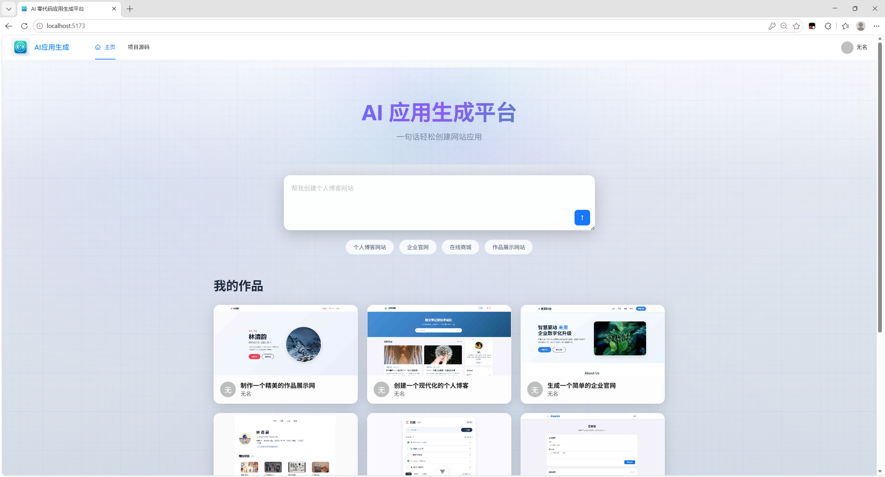
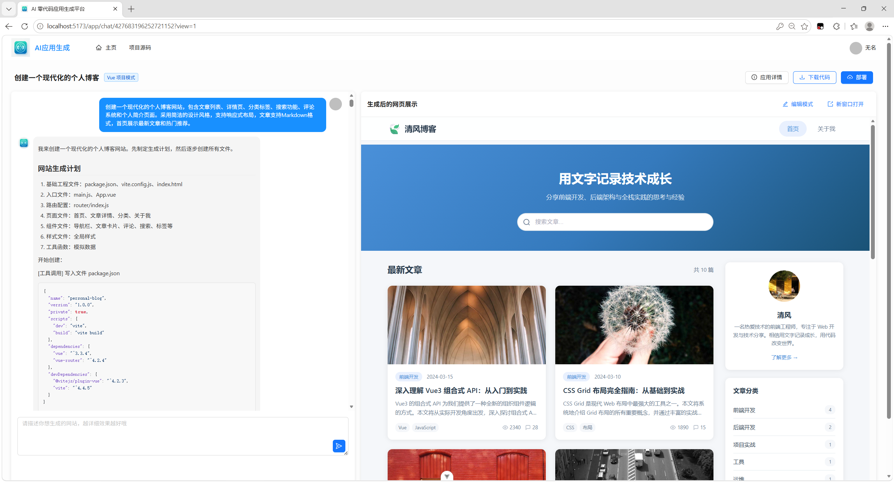
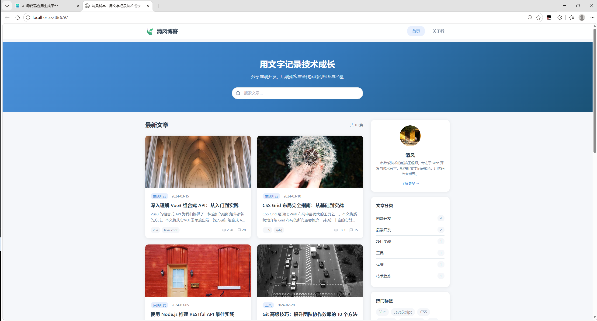
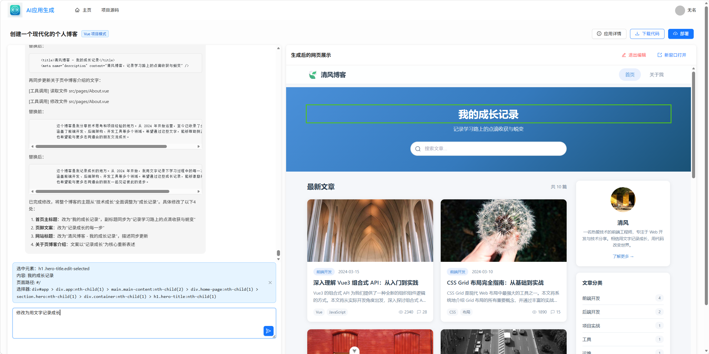
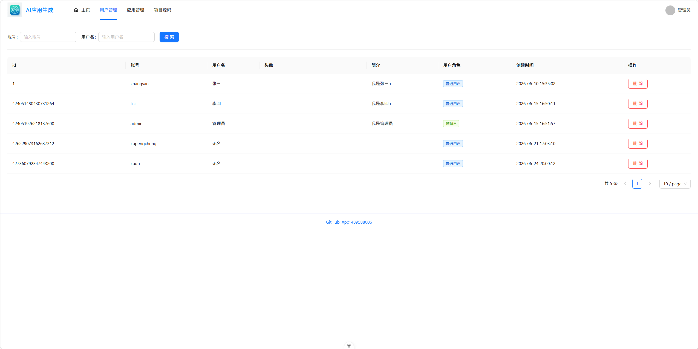
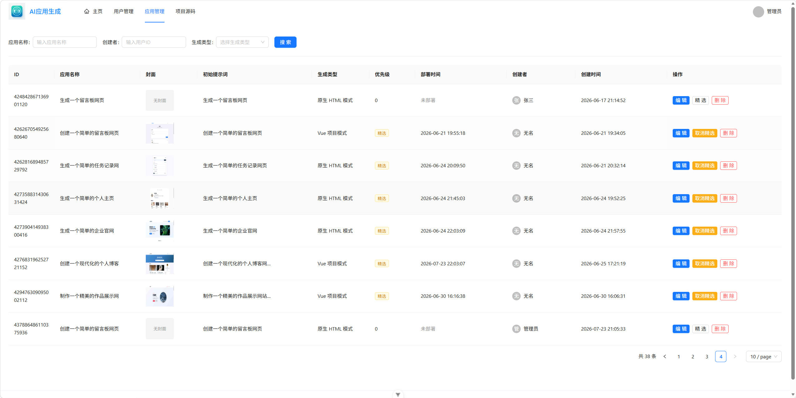

# AI 零代码生成平台

一个面向普通用户和开发者的 AI 零代码应用生成平台。用户只需要输入自然语言需求，平台即可自动创建应用、持续对话迭代、实时预览生成结果，并支持一键部署、代码下载、精选案例展示和后台管理。

> 1.首页
>
> 
>
> 2.生成页和预览页
>
> 
>
> 3.部署成功
>
> 
>
> 4.可视化修改
>
> 
>
> 5.系统管理
>
> 
>
> 

## 项目亮点

- 自然语言生成应用：输入一句需求即可创建应用，AI 自动判断适合的代码生成模式。
- 多形态代码生成：支持原生 HTML、原生多文件项目、Vue 工程三种生成类型。
- 流式生成体验：后端通过 SSE 持续返回 AI 生成内容，前端实时展示生成过程。
- 可视化迭代编辑：预览区支持选择页面元素，将元素上下文带回对话中进行定向修改。
- 自动构建与部署：Vue 工程可自动构建，生成结果可复制到部署目录并返回访问地址。
- 代码资产闭环：支持应用预览、部署、源码 ZIP 下载、封面截图生成与应用列表管理。
- AI 工作流增强：基于 LangGraph4j 编排图片采集、Prompt 增强、路由、代码生成、代码质量检查和项目构建。
- 工程化后端能力：包含登录鉴权、角色权限、限流、缓存、会话持久化、接口文档、监控指标等基础设施。
- 微服务拆分雏形：保留 `no-code-mircroservice` 多模块工程，覆盖 common、model、client、user、app、ai、screenshot 等模块。

## 主要功能

### 用户侧

- 用户注册、登录、登录态维护
- 首页输入需求并创建应用
- 我的作品分页展示
- 精选案例分页展示
- 应用详情查看、名称编辑、删除
- AI 对话式生成和迭代应用
- 生成结果 iframe 实时预览
- 新窗口打开预览页面
- 一键部署生成应用
- 下载生成源码 ZIP
- 查看历史对话并加载更多记录

### AI 生成侧

- 代码生成类型智能路由
- HTML 单文件生成
- 多文件原生项目生成
- Vue 项目生成
- AI 流式响应解析与保存
- 对话记忆与历史消息存储
- 文件读写、修改、删除、目录读取等工具调用能力
- Prompt 安全护栏和输出重试护栏
- 代码质量检查与失败重试
- 图片、Logo、插画、Mermaid 图等资源采集节点

### 管理侧

- 用户管理
- 应用管理
- 对话记录管理
- 精选应用优先级配置
- 管理员权限校验

## 技术栈

### 后端

- Java 21
- Spring Boot 3.5.x
- Spring Web / AOP / Actuator
- Spring Session + Redis
- MyBatis-Flex
- MySQL
- LangChain4j
- LangGraph4j
- Reactor / Flux / SSE
- Redisson
- Caffeine
- Knife4j / OpenAPI 3
- Selenium + WebDriverManager
- 腾讯云 COS
- Micrometer + Prometheus
- Hutool
- Lombok

### 前端

- Vue 3
- TypeScript
- Vite 7
- Ant Design Vue
- Vue Router
- Pinia
- Axios
- Markdown-It
- Highlight.js
- OpenAPI TypeScript 代码生成
- ESLint / Prettier / vue-tsc

### 微服务相关

- Spring Cloud 2023
- Spring Cloud Alibaba
- Apache Dubbo
- Nacos
- Maven 多模块工程

## 系统架构

```text
用户输入需求
   |
   v
前端 Vue 应用
   |
   v
Spring Boot API
   |
   +--> 应用/用户/对话管理
   +--> AI 代码生成服务
   +--> SSE 流式输出
   +--> 代码解析与文件保存
   +--> 静态资源预览
   +--> 构建、部署、下载
   +--> 截图生成与 COS 上传
```

AI 生成工作流：

```text
图片资源采集 -> Prompt 增强 -> 类型路由 -> 代码生成 -> 质量检查 -> 项目构建/结束
```

## 目录结构

```text
no-code
├── src/main/java/com/xpc/nocode        # 单体后端主工程
│   ├── ai                              # AI 服务、工具、模型、护栏
│   ├── controller                      # REST API 控制器
│   ├── core                            # 代码解析、保存、构建、流处理
│   ├── langgraph4j                     # AI 工作流编排
│   ├── model                           # DTO、VO、Entity、Enum
│   ├── service                         # 业务服务
│   ├── ratelimter                      # 分布式限流
│   └── monitor                         # AI 调用监控上下文
├── src/main/resources
│   ├── mapper                          # MyBatis-Flex Mapper XML
│   ├── prompt                          # AI 系统 Prompt
│   └── application.yml                 # 后端配置
├── no-code-front                       # Vue 前端工程
│   ├── src/api                         # OpenAPI 生成的接口请求
│   ├── src/components                  # 公共组件
│   ├── src/pages                       # 页面
│   ├── src/router                      # 路由
│   └── src/stores                      # Pinia 状态
└── no-code-mircroservice               # 微服务多模块工程
    ├── no-code-common
    ├── no-code-model
    ├── no-code-client
    ├── no-code-user
    ├── no-code-app
    ├── no-code-ai
    └── no-code-screenshot
```

## 快速开始

### 环境要求

- JDK 21+
- Maven 3.9+
- Node.js 22+
- MySQL 8+
- Redis 6+
- Chrome / Chromium
- 可用的大模型 API Key

### 后端启动

1. 创建 MySQL 数据库：

```sql
CREATE DATABASE no_code DEFAULT CHARACTER SET utf8mb4 COLLATE utf8mb4_unicode_ci;
```

2. 修改后端配置：

```yaml
spring:
  datasource:
    url: jdbc:mysql://localhost:3306/no_code
    username: root
    password: your_password
  data:
    redis:
      host: localhost
      port: 6379
```

3. 启动后端：

```bash
./mvnw spring-boot:run
```

后端默认地址：

```text
http://localhost:8123/api
```

接口文档：

```text
http://localhost:8123/api/doc.html
```

### 前端启动

```bash
cd no-code-front
npm install
npm run dev
```

前端环境变量示例：

```env
VITE_DEPLOY_DOMAIN=http://localhost
VITE_API_BASE_URL=http://localhost:8123/api
```

### 前端接口代码生成

后端启动后，在前端目录执行：

```bash
npm run openapi2ts
```

## 配置说明

常见配置项：

| 配置项 | 说明 |
| --- | --- |
| `spring.datasource.*` | MySQL 连接配置 |
| `spring.data.redis.*` | Redis 连接配置 |
| `spring.session.store-type` | 登录会话存储方式 |
| `code.deploy-host` | 生成应用部署后的访问域名 |
| `management.endpoints.web.exposure.include` | Actuator 暴露端点 |
| `VITE_API_BASE_URL` | 前端请求后端 API 地址 |
| `VITE_DEPLOY_DOMAIN` | 前端拼接部署应用访问地址 |

生成与部署目录：

```text
tmp/code_output   # AI 生成源码目录
tmp/code_deploy   # 已部署静态应用目录
```

## 项目展示建议

可以在 `docs/images` 下补充以下截图：

- `home.png`：首页需求输入、我的作品、精选案例
- `chat-preview.png`：左侧 AI 对话、右侧实时预览
- `visual-edit.png`：可视化选中元素后进行定向修改
- `deploy-success.png`：部署成功弹窗和访问地址
- `admin.png`：后台管理页面

## 后续规划

- 支持更多代码生成模板和技术栈
- 增加生成应用的版本管理与回滚
- 增强可视化编辑能力
- 增加团队协作与应用共享
- 接入更多部署渠道
- 完善微服务版本的独立部署方案
